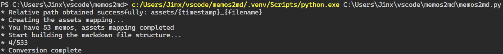
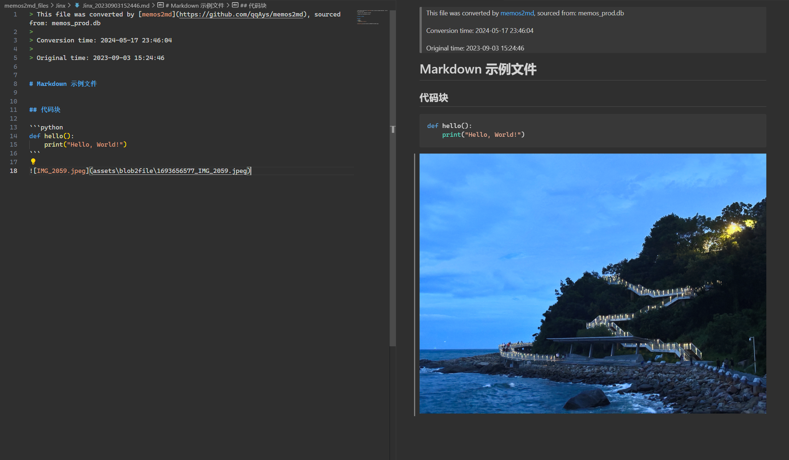

# memos2md
这是一个memos转换markdown脚本，通过读取数据库关系，区分用户建立md文件并处理附件。

# 使用方法

1. 参考 [Using Python on Unix platforms](https://docs.python.org/3/using/unix.html) 安装python3，如本地存在，则无需安装额外依赖。
2. 将 `memos2md.py` 放置到 memos 的数据目录下，文件结构看起来像下面一样（不同的设置可能会导致目录结构有所不同，复制到与 `memos_prod.db` 同一目录下即可）：
    ```md
    ./
    ├── assets
    │   ├── 1695436471_f7adca31d257093592b84abfd5a105c2.jpeg
    │   └── ...(attachment)
    ├── memos_prod.db
    └── memos2md.py
    ```
3. 执行 `python memos2md.py` 即可。
4. 导出的文件将在 `memos2md_files` 中。

# 示例

## 运行示例



## 导出示例

```md
./memos2md_files
├─ Jinx
│  │  Jinx_20230829192941.md
│  │  ...
│  │  Jinx_20231114210821.md
│  │  Jinx_20240322235236.md
│  │
│  └─ assets
│      │  1695436471_f7adca31d257093592b84abfd5a105c2.jpeg
│      │  1695436471_IMG_2166.jpeg
│      │  1695436471_IMG_2176.jpeg
│      │  1695436471_IMG_2187.jpeg
│      │  ...
│      │
│      └─ blob2file
│              1693308581_image.jpg
│              1693656577_image.jpg
│              1693656577_IMG_2048.jpeg
│              ...
│
└─ User2
    │  User2_20230828160701.md
    │  User2_20230829184826.md
    │  User2_20230830193503.md
    │  ...
    │
    └─ assets
        │  1696134406_IMG_1900.jpeg
        │  1696137250_IMG_1913.jpeg
        │  1696137251_IMG_1914.jpeg
        │  ...
        │
        └─ blob2file
                1693656657_image.jpg
```

